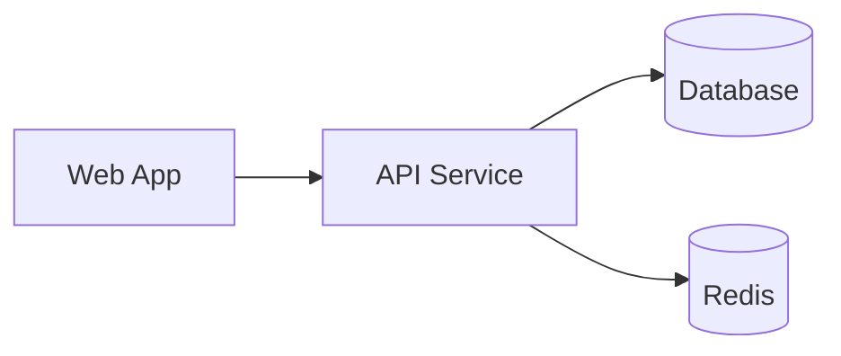

# Infra Diagram

When invoked, extract high-level infrastructure components and relationships from available sources (Terraform, docker-compose, architecture docs) and:

- Produce one or more Mermaid diagrams (graph LR or TD) representing services, networks, DBs, and external dependencies
- Keep diagrams focused (one concept per diagram) and include node labels and short descriptions
- Provide a brief legend and suggested locations to save diagrams (e.g., `docs/architecture.md`)
- Validate Mermaid syntax when possible and suggest splitting large systems into multiple diagrams

Example output:

Include source references (file paths and lines) for each extracted component.